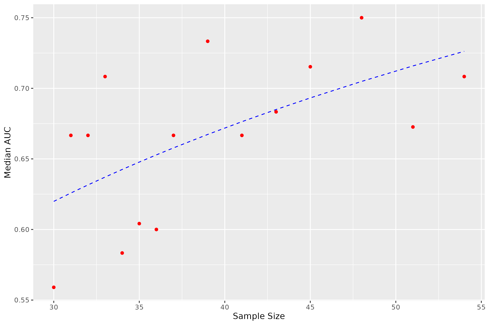

# Sample Size Estimation for Classification Performance
Sample size estimation for ICI responder Vs ICI non-responder classification from microbial data
A standard pipeline has been developed to estimate sample size required to achieve a targeted performance in classifying responders versus non-responders to Immune checkpoint inhibitor (ICI) using data from a publicly available microbiome dataset for ICI clinical trials [1]. A progressive sampling and learning curve fitting techniques was developed as previously suggested [2]. We incrementally increased the sample size, estimated the classification performance of an optimised machine learning model (i.e., Random Forest) on a 20% holdout set, and obtained a fitted learning curve. This analysis suggests that having 30~50 samples per class (ICR-Rs versus ICI-NRs) could be sufficient to achieve a machine learning model with the predictive power (AUC) of 75% to 85%. 

# Steps in the pipeline
* Data : species level or all level abundance
* Filter out features with 0 overall abundance
* Add 10-5 to all values
* Log transform
* z – score normalization
* Obtain best features using Ranger as feature selection method
* Apply classification models on the best features
* Choose features >= 0 importance as returned by Ranger
* Obtain AUC, accuracy on test data

* Median accuracy and AUC across 50 different train-test splits reported on test set

# Predicted sample size

# References
[1] Lee KA, Thomas AM, et al.Cross-cohort gut microbiome associations with immune checkpoint inhibitor response in advanced melanoma. Nat Med 2022.
[2] Figueroa, Rosa L., et al. "Predicting sample size required for classification performance." BMC medical informatics and decision making 12.1 (2012): 1-10.
